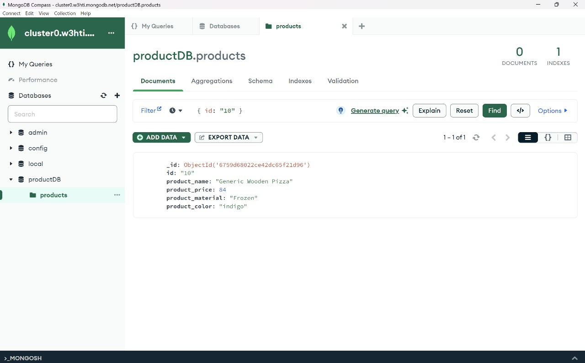

# MongoDB Queries - Product Collection

This repository contains various MongoDB queries applied to a product collection. 

The initial MonogDB Compass after Importing Data
- **Image:**
  

---

## Queries

### 1. **Find all the information about each product**

- **Image:**
  

---

### 2. **Find the product price which is between 400 to 800**

- **Image:**
  

---

### 3. **Find the product price which is not between 400 to 600**

- **Image:**
  

---

### 4. **List the four products which are greater than 500 in price**

- **Image:**
  

---

### 5. **Find the product name and product material of each product**

- **Image:**
  

---

### 6. **Find the product with a row id of 10**

- **Image:**
  

---

### 7. **Find only the product name and product material**

- **Image:**
  

---

### 8. **Find all products which contain the value of "soft" in product material**

- **Image:**
  

---

### 9. **Find products which contain product color "indigo" and product price 492.00**

- **Image:**
  

---

### 10. **Delete the products where product price value is 28**

- **Image:**
  

- **Image:**
  

---

---

